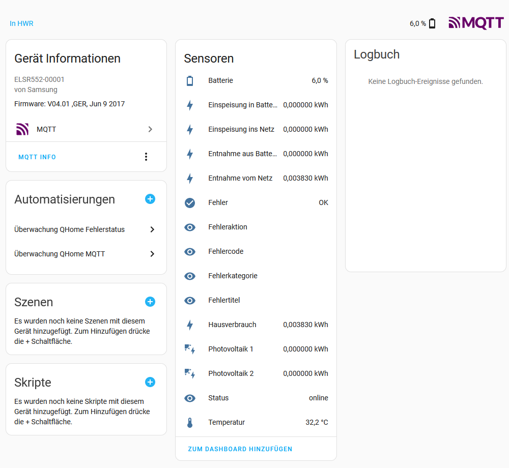
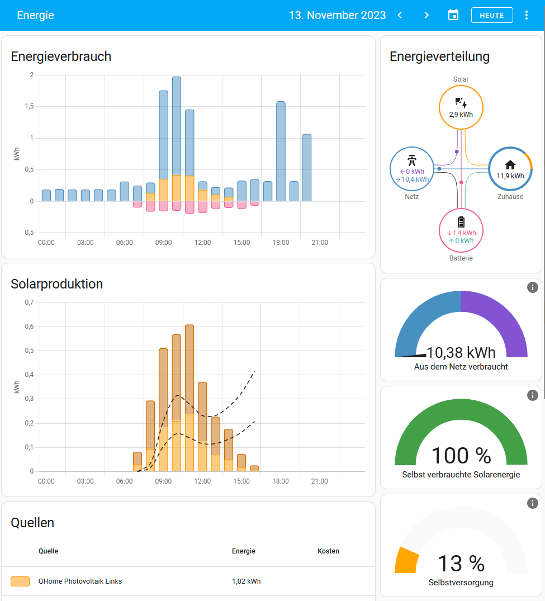

# Hansol/Samsung AIO MQTT

Hansol AIO MQTT is a Python script for reading out the photovoltaic battery storage from Samsung or Hansol of the All-in-One series. [Hansol AIO photovoltaic devices](https://myess.hansoltechnics.com/prod/prod.do#1). 

The maintenance page integrated there is read out twice a minute and the values determined for the battery level, house consumption, feed-in, grid withdrawal and PV production are made available for HomeAssistant via MQTT. The values can also be written directly to a MariaDB/MySQL database.

I generally wrote the script for myself, as I want to evaluate the data over days, weeks and months. At the same time, however, I also wanted to use the energy display in [Home Assistant](https://www.home-assistant.io), so I decided to transfer the values via MQTT.

## Download

To use the script, select one of the following options to get started:

- Clone the repository: `git clone https://github.com/Xembalo/hansol-aio-mqtt.git`
- [Fork, Clone, or Download on GitHub](https://github.com/Xembalo/hansol-aio-dashboard)

## Preparation and installation

If you want to use all functions, you need the following:

- a Home Assistant installation
- a MariaDB/MySQL database
- a MQTT broker, for example [Mosquitto](https://mosquitto.org/)
- a runtime environment with Python3, which is available 24/7 in the local network.

### Setting up the database

Basically, the script `init_db.sql` can be used to initialize die database. However, the user name and password should still be adjusted.

### Setting up the environment (Python)

The script requires Python3. It is best installed in a `venv`. 

```
cd /path/to/dir/hansol-aio-mqtt
python3 -m venv .
source bin/activate
pip install paho-mqtt PyMySQL BeautifulSoup4 requests
python3 aio-mqtt.py --help
```

The possible call parameters are then displayed.

The script can be integrated into systemd for permanent startup. 

### Setting up the environment (Docker)

Alternatively, the script can also be packaged in a Docker image. I run it on a Synology NAS, for example. The necessary files are located in the `docker` subfolder and can be accessed via 

```
docker build -t username/imagename .
docker push username/imagename
```

The script parameters can be specified via environment variables:

```
docker container run -e ESS_HOST=localhost -e MARIADB_ENABLED=1 -e ... username/imagename

ENV ESS_HOST=
ENV MARIADB_ENABLED=
ENV MARIADB_HOST=
ENV MARIADB_PORT=
ENV MARIADB_USER=
ENV MARIADB_PASS=
ENV MARIADB_DATABASE=
ENV MQTT_ENABLED=
ENV MQTT_CLIENT_IDENTIFIER=
ENV MQTT_TOPIC=
ENV MQTT_HOST=
ENV MQTT_PORT=
ENV MQTT_QOS=
```

## Integration in Home Assistant

If MQTT integration is already active in Home Assistant, the new device and its sensors will be found directly. Otherwise, the [MQTT integration still needs to be set up](https://www.home-assistant.io/integrations/mqtt).



So that the sensors can be used in the energy dashboard, I had to create my own sensors in the `configuration.yaml` of Home Assistant:

```
utility_meter:
  feedin_battery:
    source: sensor.einspeisung_in_batterie
    name: QHome Einspeisung in Batterie
    cycle: daily
    delta_values: true
  demand_battery:
    source: sensor.entnahme_aus_batterie
    name: QHome Entnahme aus Batterie
    cycle: daily
    delta_values: true
  feedin_grid:
    source: sensor.einspeisung_ins_netz
    name: QHome Einspeisung ins Netz
    cycle: daily
    delta_values: true
  demand_grid:
    source: sensor.entnahme_vom_netz
    name: QHome Entnahme vom Netz
    cycle: daily
    delta_values: true
  consumptation:
    source: sensor.hausverbrauch
    name: QHome Hausverbrauch
    cycle: daily
    delta_values: true
  photovoltaik_left:
    source: sensor.photovoltaik_1
    name: QHome Photovoltaik Links
    cycle: daily
    delta_values: true
  photovoltaik_right:
    source: sensor.photovoltaik_2
    name: QHome Photovoltaik Rechts
    cycle: daily
    delta_values: true
```

**If anyone knows how to do it without, please let me know!**

These sensors can then be used for the energy dashboard.



## Bugs and Issues

Have a bug or an issue or an idea for further statistics? [Open a new issue](https://github.com/Xembalo/hansol-aio-mqtt/issues) here on GitHub.

## About

This project was created by and is maintained by **Sebastian Wienecke**.


-   <https://github.com/Xembalo>

Special thanks to the users from [Photovoltaikforum.com](www.photovoltaikforum.com) in particular but not exclusively to user "fsg4u" for his [bash skript](https://www.photovoltaikforum.com/thread/102631-hat-schon-jemand-erfahrung-mit-dem-samsung-sdi-ess/?postID=1758839#post1758839) to collect the data. 

## Copyright and License

All named trademarks and productnames are the property of their respective owners.

Copyright 2019-2023 Sebastian Wienecke. Code released under the [MIT](https://github.com/Xembalo/hansol-aoi-dashboard/LICENSE) license.